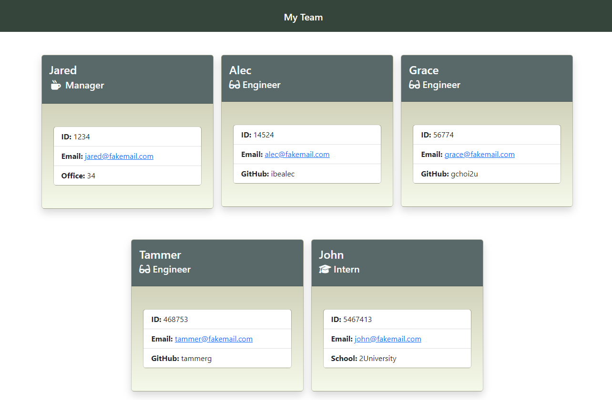

# Team Builder

## Description

AS A manager

I WANT to generate a webpage that displays my team's basic info

SO THAT I have quick access to their emails and GitHub profiles

## Table of Contents

- [Installation](#installation)
- [Technologies](#technologies)
- [Usage](#usage)
- [Screenshots](#screenshots)
- [Questions](#questions)

## Technologies

- NodeJS
- Bootstrap CSS
- Inquirer
- HTML, CSS, and JavaScript
- Jest

## Installation

You will need Node.js to run the application. You can find a guide on installation [here](https://coding-boot-camp.github.io/full-stack/nodejs/how-to-install-nodejs).

**Step 1**

> Clone the repository to your local machine.

**Step 2**

> cd to the directory with your cloned repo.

**Step 3**
Install the dependencies to generate your node_modules and a package-lock.json

    npm install

Now you’re ready to start building your Team!

## Usage

To run the application, type the following command in your terminal.

    node index.js

Answer all prompts, and an HTML page like the one displayed in the screenshot below will generate in your `dist` directory.

This [demo](https://drive.google.com/file/d/15X5Y2DvB4sCdZF4dJ79b4wmZmRyJWjm7/view?usp=sharing) shows the app in action!

## Screenshots

#### Questions

If you have any question about the application, feel free to reach out here:

- <a href="https://github.com/joesen-dev">Github</a>
